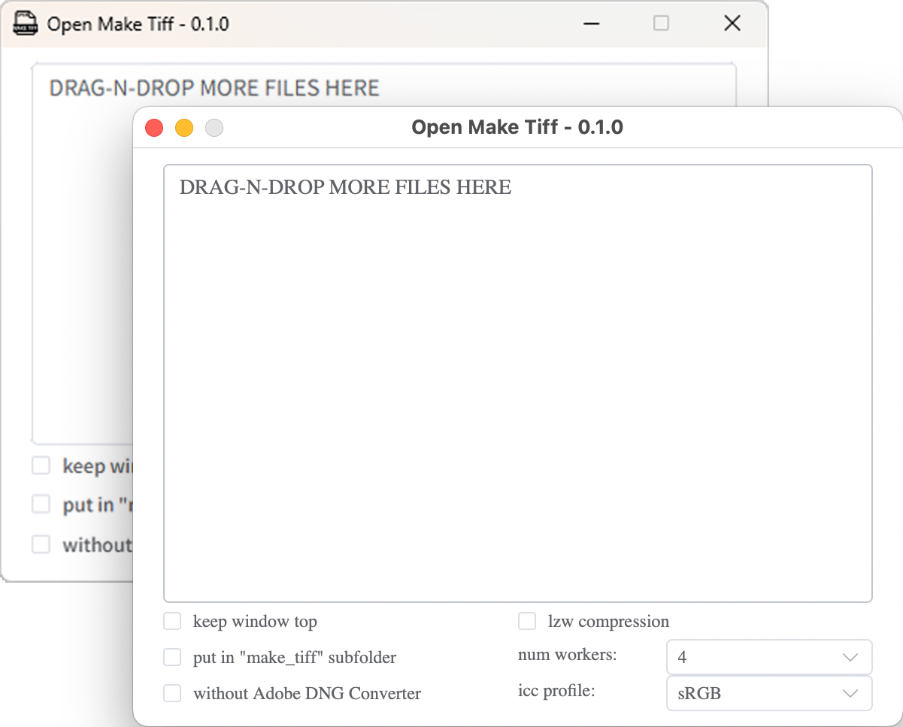

English | [简体中文](./README_zh-CN.md)

# Open Make TIFF



## About

Open Make TIFF is a free, open-source alternative to [MakeTiff](https://www.colorperfect.com/MakeTiff/). It converts RAW camera images into linear TIFF files without any hidden color adjustments.

## Why Linear TIFF?

Most RAW converters apply hidden color tweaks intended to "improve" the image. For professional workflows that require complete control over color processing, you need truly unprocessed data:

- **Linear gamma** - preserves the original sensor response
- **No color processing** - no white balance, no color matrix, no tone curve applied

This gives you complete freedom to apply your own color workflow from scratch.

## Features

- **Drag & Drop** - Drop RAW files directly onto the window
- **Multi-threaded Processing** - Parallel conversion with configurable worker count
- **Built-in ICC Profiles** - 6 RGB working spaces included
- **Subfolder Output** - Output to `make_tiff` subfolder for organization
- **Window Always on Top** - Keep the window above other applications
- **Cross-platform** - macOS and Windows support
- **CLI Mode** - Batch conversion without GUI (`open-make-tiff [flags] <files>`)
- **LZW Compression** - Optional LZW compression to reduce output file size
- **RawSpeed Acceleration** - Leverages RawSpeed library for faster RAW decoding
- **Native CGo Integration** - LibRaw and libtiff compiled directly into the binary
- **TIFF Format Support** - Supports processing TIFF format files (e.g. .fff) in addition to RAW

## How it works

Open Make TIFF uses a combination of libraries and tools:

1. **Adobe DNG Converter** (optional) - Recognizes camera models, performs Bayer interpolation
2. **LibRaw** (native CGo integration) - RAW decoding, demosaicing, linear TIFF generation, with RawSpeed acceleration and GPL2/GPL3 demosaic algorithm packs
3. **libtiff** (native CGo integration) - TIFF read/write with LZW compression
4. **ExifTool** - Copies original EXIF metadata and embeds ICC profile

## Prerequisites

- macOS or Windows
- [Adobe DNG Converter](https://helpx.adobe.com/camera-raw/using/adobe-dng-converter.html) (optional but recommended for best camera support)

## Installation

Download the latest release from the [Releases](../../releases) page.

## Usage

1. Launch Open Make TIFF
2. Drag and drop RAW files onto the window
3. Configure options as needed:
   - **Workers**: Number of parallel conversion threads
   - **ICC Profile**: RGB working space to embed
   - **Subfolder**: Output to `make_tiff` subfolder
   - **Always on Top**: Keep window above other apps
   - **Disable DNG Converter**: Use Libraw directly (for cameras not supported by Adobe)

### CLI

```
Usage: open-make-tiff [flags] <input-file> [input-file...]

Flags:
  -no-dng             disable Adobe DNG Converter
  -subfolder          output to a "make_tiff" subfolder
  -compress           enable LZW compression
  -profile string     ICC profile (AdobeRGB1998, BT2020, DisplayP3, HasselbladRGB, ProPhoto, sRGB)
  -workers int        number of parallel workers (default: max(NumCPU/2, 1))
  -keep-log           keep log files after conversion
  -keep-intermediate  keep intermediate DNG/TIFF files
```

## Supported ICC Profiles

| Profile | Description |
|---------|-------------|
| sRGB | Standard RGB color space |
| Adobe RGB 1998 | Wide gamut color space |
| Display P3 | Apple Display P3 |
| ProPhoto | Very wide gamut color space |
| BT.2020 | Rec. 2020 UHDTV color space |
| Hasselblad RGB | Hasselblad native color space |

## Supported RAW Formats

Common RAW formats including:
- Canon (.cr2, .cr3)
- Nikon (.nef)
- Sony (.arw)
- Fujifilm (.raf)
- Hasselblad (.fff, .3fr)
- And more...

## License

[GPL-3.0](./LICENSE)
